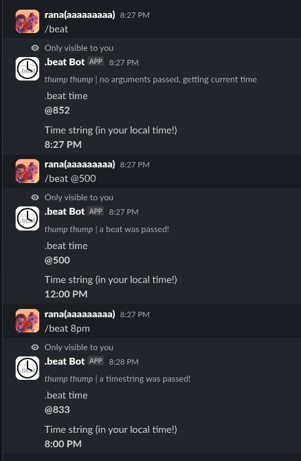

# .beat time Slack Bot
A Slack bot that converts [Internet time/.beat time](https://en.wikipedia.org/wiki/Swatch_Internet_Time) into a human-readable time format and vice versa.

## Usage
Once installed to a workspace, All you need to do is run /beat. You can even specify what you want to convert!
- Just want the current time? Run `/beat` or `/beat now`, and it'll get the current time in Internet time!
- Want to figure out when `@728` is? Run `/beat @728` and you can figure out when it is! (It's 5:28pm BST, if you were wondering.)
- You can also convert using natural language! `/beat in 4 hours`, `/beat in half an hour`, just as long as it has some sort of time phrase within it, it should work!



## Installation
1. Clone the repository:
```bash
$ git clone https://github.com/DaInfLoop/beat-time-slack.git
```

2. Setup your `.env` file like this:
```ini
NODE_ENV=<development/production>
PORT=3000

APP_TOKEN=xoxb-.......
SIGNING_SECRET=<signing secret>

# Only really matter when NODE_ENV is "development"!
NGROK_TOKEN=<ngrok API token or "NONE">
NGROK_DOMAIN=<ngrok domain to proxy via, optional>
```

3. Install dependencies (I use pnpm, but you can use any package manager of your choice!)
```bash
$ pnpm i
```

4. Run the bot!
```bash
$ pnpm start
```

## Licensing
This repository is licensed under the MIT License. A version of it can be read at [LICENSE](/LICENSE).